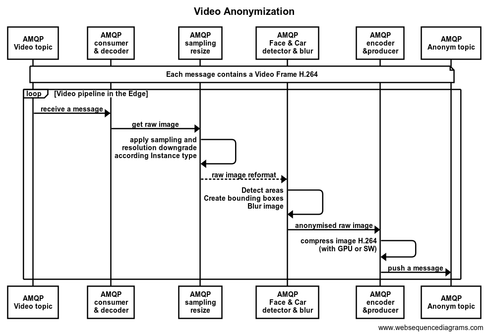

# Video Anonymizator

## Overview
This repository provides the modules to anonymise video streams at the MEC infrastructures.

This way the Video Anonymizator subscribe to all the H.264 video streams in the `video` _topic_ and push processed/anonymised video flows in the `video_anonym` _topic_.

The accepted video formats to be pushed to the discovered 5GMETA MEC platform are:

 - H.264: AVC standard for video (can be extended to HEVC format)

## Prerequisites
The prerequisites here are:
- Infrastructure:
	- A Kubernetes infrastructure for the 5GMETA MEC platform already registered at the 5GMETA Cloud Discovery service 
	- To have access to the 5GMETA Cloud platform Discovery service
	- To have a AMQP server running at the discovered 5GMETA MEC platform
	- To have a WebRTC proxy running at the discovered 5GMETA MEC platform
- Device:
	- Have a virtualized NVIDIA GPU operated through K8s
- Dependencies
	- The MEC system can use the provided Docker or to natively include these requirements:

> PIP3 \
> docker == 4.1.0 \
> requests == 2.22.0 \
> pygeotile == 1.0.6 \
> object_detection >= 0.0.3 \
> opencv-python >= 4.6.0.66 \
> tensorflow-addons >= 0.18.0 \
> tensorflow-datasets >= 4.7.0 \
> tensorflow-estimator >= 2.10.0 \
> tensorflow-hub >= 0.12.0 \
> tensorflow-io >= 0.27.0 \
> tensorflow-io-gcs-filesystem \
> tensorflow-metadata >= 1.10.0 \
> tensorflow-model-optimization >= 0.7.3 \
> tensorflow-text >= 2.10.0 \
> tf_slim >= 1.1.0 \
> PACKETS \
> gstreamer >= 1.18.5 \
> gstreamer1.0-rtsp \
> python3 \
> python3-pip \
> libjson-glib-1.0-0 \
> libjson-glib-dev \

## Features

Different advanced features are provided when performing naonymisation processing:

 - GPU acceleration: use the NVIDIA features to encode/decode the video streams, needing an NVIDIA GPU virtualized through K8s. For that a parameter `ENABLE\_NV="True"` can be set in the Docker
 - Quality downgrade: reduce the resolution and framerate of the output anonymised video streams to consume less computing assets and fit into the consumer terms. For that the parameters `OUTPUT\_FPS="0"` `OUTPUT\_WIDTH="0"` `OUTPUT\_HEIGHT="0"` allow to keep nominal resolutions and sampling rates (when 0 is set) or to downsample.

## Deployment

In the `deployment` folder different instructions to operate the involved Docker are described.

This section overviews the way to deploy the containers for the following modules:
- Video Anonymizator to receive the Video Stream in H.264 in the `video` _topic_ to be processed by Pipelines running at the 5GMETA MEC infrastructure performing anonymisation and pushing resulting frames into the `video_anonym` _topic_. 

The instructions for that can be found in `deploy` folder while the code in `src` folder

## Authors

* Angel Martin ([amartin@vicomtech.org](mailto:amartin@vicomtech.org))

## License

Copyright : Copyright 2022 VICOMTECH

License : EUPL 1.2 ([https://eupl.eu/1.2/en/](https://eupl.eu/1.2/en/))

The European Union Public Licence (EUPL) is a copyleft free/open source software license created on the initiative of and approved by the European Commission in 23 official languages of the European Union.

Licensed under the EUPL License, Version 1.2 (the "License"); you may not use this file except in compliance with the License. You may obtain a copy of the License at [https://eupl.eu/1.2/en/](https://eupl.eu/1.2/en/)

Unless required by applicable law or agreed to in writing, software distributed under the License is distributed on an "AS IS" BASIS, WITHOUT WARRANTIES OR CONDITIONS OF ANY KIND, either express or implied. See the License for the specific language governing permissions and limitations under the License.

